# THE CAT COLLECTION archive
Archive of all images from https://the-cat-collection.ru.  
The website gallery broke some time in the last few months so it is no longer accessible, so I have downloaded all available assets here.  
Descriptions translated from Russian using Google Translate.

|                       Cat                       |                                     Name                                      |                                                                                                                                                                                                          Description                                                                                                                                                                                                          |
| ----------------------------------------------- | ----------------------------------------------------------------------------- | ----------------------------------------------------------------------------------------------------------------------------------------------------------------------------------------------------------------------------------------------------------------------------------------------------------------------------------------------------------------------------------------------------------------------------- |
| <a href="pe_sm">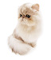</a> | Persian cat <i>Персидская кошка</i>                            | The Persian cat is probably one of the most fluffy representatives of the cat breed. <i>Персидская кошка - наверно одна из самых пушистых представителей кошачьей породы. </i>                                                                                                                                                                                                                                 |
|  | Russian blue <i>Русская голубая</i>                            | The Russian Blue cat is regal, known for its silvery gray coat and bright green or blue eyes. <i>Русская голубая кошка - царственная особа, известная своей серебристо-серой шубкой и ярко-зелеными или голубыми глазами.</i>                                                                                                                                                                                  |
| <a href="si_sm">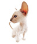</a> | Siamese cat <i>Сиамская кошка</i>                              | The Siamese cat is an amazing combination of charm, grace and hunting instinct. The refined beauty and lively mind of this cat bring her unchanging popularity. <i>Сиамская кошка - удивительная комбинация обояния, грации и охотничьего инстинкта. Утонченная красота и живой ум это кошки приносят ей неизменную популярность.</i>                                                                          |
| <a href="bl_sm">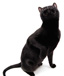</a> | Black cat <i>Черный кот</i>                                    | The black cat has always occupied a special position among the representatives of the cat family. Today it is considered very prestigious to have a small panther in the house, affectionate and good-natured. <i>Черный кот  во все времена занимал особое положение среди представителей семейства кошачьих. Сегодня считается очень престижно иметь в доме маленькую пантеру, ласковую и добродушную . </i> |
| <a href="mc_sm">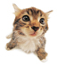</a> | Maine Coon <i>Мейн-Кун</i>                                     | The majestic Maine Coon with his lynx tassels on his ears has won many hearts. <i>Величественный Мэйн-кун с его рысьими кисточками на ушах завоевал немало сердец.</i>                                                                                                                                                                                                                                         |
|  | bengal cat <i>Бенгальская кошка</i>                            | The Bengal cat is a truly graceful creature, unhurried and languid, with excellent plasticity of movements. <i>Бенгальская кошка – это поистине грациозное существо, неторопливое и томное, обладающее прекрасной пластикой движений.</i>                                                                                                                                                                      |
| <a href="hi_sm">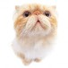</a> | Himalayan cat <i>Гималайский кот</i>                           | The Himalayan combines the best qualities of the best cat breeds: the predatory grace of the Siamese and the charming fluffiness of the Persians. <i>Гималаец совмещает в себе лучшие качества лучших кошачьих пород :  хищную грацию сиамок и обаятельную пушистость персов.</i>                                                                                                                              |
| <a href="no_sm">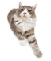</a> | norwegian forest cat <i>Норвежский лесной кот</i>              | This giant with lynx tassels on the ears is the official cat of Norway and personifies the harsh and beautiful nature of the country. <i>Этот гигант с рысьими кисточками на ушах является официальной кошкой Норвегии и олицетворяет суровую и прекрасную природу страны.</i>                                                                                                                                 |
| <a href="so_sm">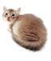</a> | somali cat <i>Сомалийский кот</i>                              | Somali is a cat with a bright flame under a silk coat, incredibly affectionate and surprisingly smart. <i>Сомали - это кошка с ярким пламенем под шелковой шубкой, невероятно ласковая и удивительно умная.</i>                                                                                                                                                                                                |
| <a href="ab_sm">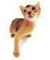</a> | Abyssinian cat <i>Абессинский кот</i>                          | "Children of the Sun" or "little cougars" - this is how people call Abyssinian cats. <i>"Дети Солнца" или "маленькие пумы" - так люди называют кошек абиссинской породы.  </i>                                                                                                                                                                                                                                 |
| <a href="es_sm">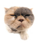</a> | shorthair exotic <i>Короткошерстный экзот</i>                  | We can say that exotic is a pug of the cat world. <i>Можно сказать что  экзот - это мопс кошачьего мира.</i>                                                                                                                                                                                                                                                                                                   |
| <a href="dr_sm">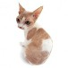</a> | Devon Rex <i>Девон-рекс</i>                                    | Devon Rex are intelligent cats. At the same time, they are playful and jumpy, very sociable and have unlimited patience. <i>Девон-рексы - кошки-интеллектуалы. При этом они игривы и прыгучи, очень общительны и обладают безграничным терпением.</i>                                                                                                                                                          |
| <a href="sn_sm">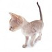</a> | singapore cat <i>Сингапурская кошка</i>                        | This inch of the cat world is listed in the Guinness Book of Records as the smallest cat breed. <i>Эта дюймовочка кошачьего мира занесена в книгу рекордов Гиннеса как самая маленькая порода кошек.</i>                                                                                                                                                                                                       |
| <a href="bi_sm">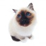</a> | Burmese cat <i>Бирманская кошка</i>                            | The Burmese cat has not only a delightful coat and sapphire blue eyes, but also an amazing pedigree. <i>Бирманская кошка   имеет не только восхитительную шерстку и сапфирно-синие глаза , но и потрясающую родословную. </i>                                                                                                                                                                                  |
| <a href="os_sm">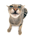</a> | Oriental shorthair cat <i>Восточный короткошёрстный кот</i>    | Oriental (Oriental) Shorthair cats are very proportional, flexible, elegant, thin animals with long lines. <i>Восточные (ориентальные) короткошерстные кошки  - очень пропорциональные,  гибкие, элегантные, тонкие с длинными линиями животные.</i>                                                                                                                                                           |
| <a href="rd_sm">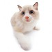</a> | ragdoll <i>Рэгдолл</i>                                         | Ragdolls are considered to be heavyweights among cats. Some individuals in length, including the tail, they can reach one meter, and weigh 9-10 kilograms. <i>Рэгдоллы по праву считаются тяжеловесами среди кошек. Некоторые особи  в длину, включая хвост, они могут достигать одного метра, и весить  9-10 килограммов. </i>                                                                                |
| <a href="ac_sm">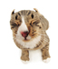</a> | american curl <i>Американская кёрл </i>                        | The American Curl is a slender cat with rolled back ears and large slanting eyes. <i>Американская кёрл - стройная кошка с завёрнутые назад ушами и большими раскосыми глазами. </i>                                                                                                                                                                                                                            |
| <a href="sf_sm">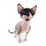</a> | Sphinx <i>Сфинкс</i>                                           | Sphynx is one of several breeds of hairless cats artificially bred for decorative purposes. <i>Сфинксы — одна из нескольких пород бесшерстных кошек, искусственно выведенных в декоративных целях.</i>                                                                                                                                                                                                         |
|  | munchkin <i>Манчкин</i>                                        | Munchkins are very unusual cats: with an average body length, their legs are 2-3 times shorter than those of ordinary cats, because of this feature they are sometimes called dachshunds. <i>Манчкины — очень необычные кошки :  при средней длине тела их лапки короче, чем у обычных кошек в 2-3 раза, из-за этой особенности их иногда называют таксами.</i>                                                |
| <a href="sb_sm">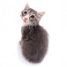</a> | Siberian cat <i>Сибирская кошка</i>                            | The Siberian cat is a portly beauty in a luxurious thick fur coat. <i>Сибирская кошка - дородная красавица в роскошной густой шубке.</i>                                                                                                                                                                                                                                                                       |
| <a href="oc_sm">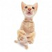</a> | Ocicat <i>Оцикет</i>                                           | The Ocicat is a domestic cat with the appearance of a small predator. <i>Оцикет - домашняя кошка с видом маленького хищника.</i>                                                                                                                                                                                                                                                                               |
| <a href="as_sm">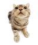</a> | american shorthair cat <i>Американский короткошерстный кот</i> | The American Shorthair is an American-style domestic cat. <i>Американская короткошерстная  - это домашняя кошка по-американски .</i>                                                                                                                                                                                                                                                                           |
| <a href="sc_sm">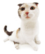</a> | Scottish lop-eared <i>Шотландская вислоухая</i>                | Scottish fold (or Scottish fold) - a cat with small ears folded forward and down, rounded at the ends. <i>Шотландская вислоухая (или скоттиш-фолд) - кошка с маленькими, сложеными вперед и вниз, округлеными на концах ушами. </i>                                                                                                                                                                            |
